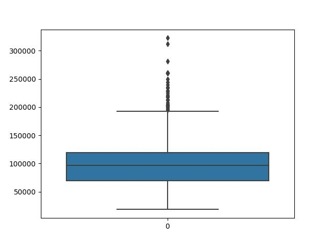
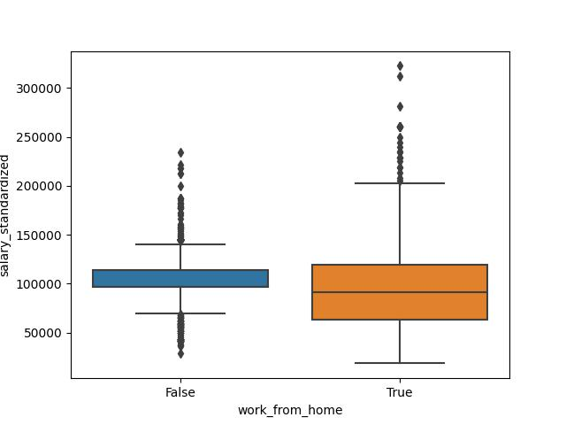
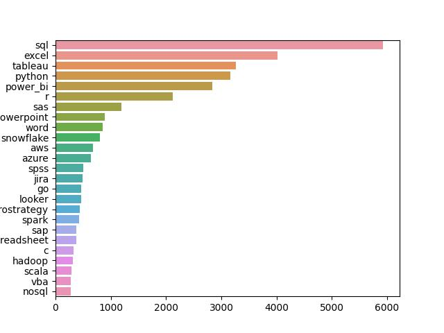
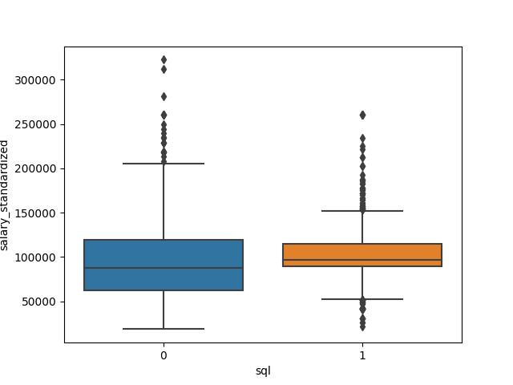
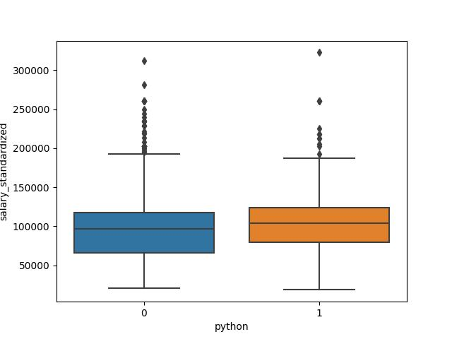
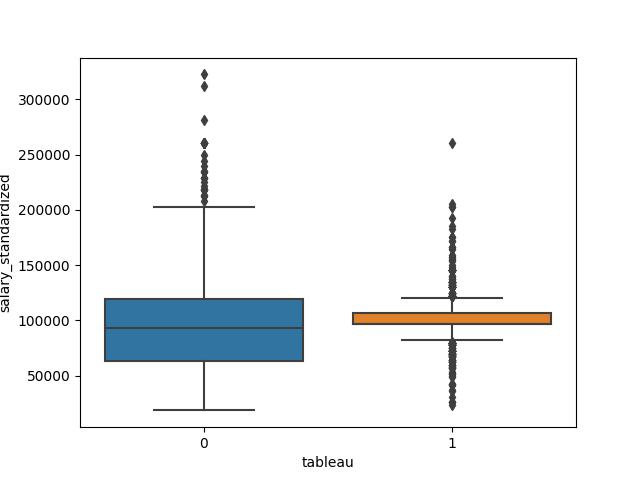
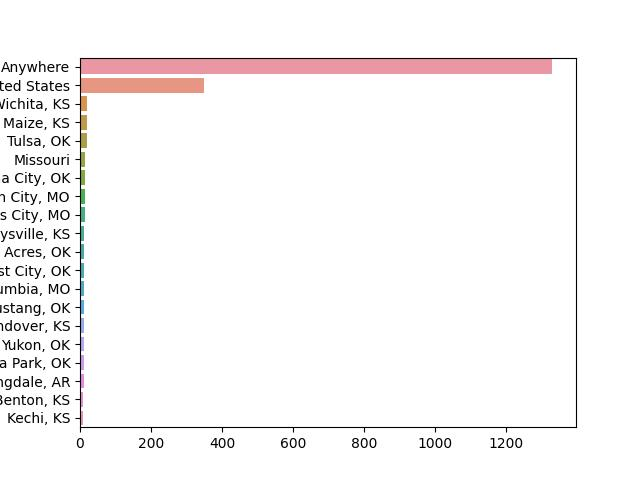
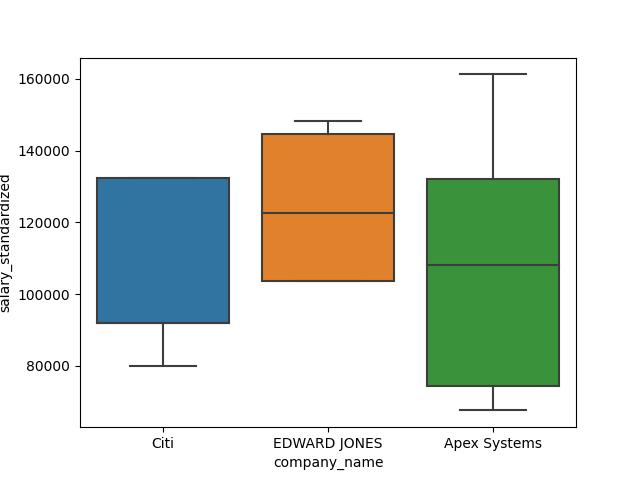

# AWS-Market-Analysis
This project aim to generate a complete ETL and EDA pipeline and analysis of the current job market for data analysts, with the aim of evaluating which skills are the most sought after, the cities and companies that are hiring the most data analysts and also investigate the salary outcome of remote vs non-remote work. The project is built using Amazon PostgresSQL, sqlalchemy, sklearn and python’s libraries such as pandas and seaborn. 

## Methodology
To start I used sqlalchemy to extract the data from the database, and created three pandas dataframes. In addition I joined the tables on their primary key, then saved the joined data into a csv file in the data folder. 

from sqlalchemy import create_engine, func
from sqlalchemy.ext.automap import automap_base
from sqlalchemy.orm import Session
import pandas as pd
from config import key 
# connect to the database
engine = create_engine(key)
Base = automap_base()
Base.prepare(engine, reflect=True)

# save classes as variables, prepare classes
jobs = Base.classes.jobs
salaries = Base.classes.salaries
skills = Base.classes.skills
# query our database (pull data and save into objects)
session = Session(engine)

#Extract all 3 tables from Amazon RDS postgres database
jobs_table = session.query(jobs)
print(jobs_table)
salaries_table = session.query(salaries)
print(salaries_table)
skills_table = session.query(skills)
print(skills_table)

# using the tables to create new pandas dataframe
jobs_df = pd.read_sql(jobs_table.statement, engine.connect())
print(jobs_df)
salaries_df = pd.read_sql(salaries_table.statement, engine.connect())
print(salaries_df)
skills_df = pd.read_sql(skills_table.statement, engine.connect())
print(skills_df)

#joining all three tables on their primary key
merge_1 = pd.merge(salaries_df, jobs_df, how="inner", on=["id"])
total_merge = pd.merge(merge_1, skills_df, how="inner", on=["id"])
print(total_merge)

# saving the joined_data into a csv file
total_merge.to_csv('data/joined_data.csv')  

After data extraction, next I transforme the data by first dropping all the null values from the description_tokens and the salary_standardized columns. Then filled in the missing values in the work_from_home column to be false. After cleaning this data I saved into csv file and into the data folder. Furthermore, I created a new column for each possible skill in the description_tokens column using a multi label binarizer. I first converted the description_tokens column into a column of lists then encoded each skill as a unique column, then save it as csv file into the data folder.

 Lastly, after cleaning and preparing all the data, I did some eda in order to answer the questions above. I created some visualisation of the distribution of standard_salaries and then exploring the salaries of working from home vs office. Also salaries of jobs that require skills such as python, tableau or sql versus jobs that do not require these skills. I also looked at top ranked skills, companies and cities for data analysts positions. To get more insight I did statistical analysis by performing a t-test and a Kolmogorov Smirnov test. 

## Visuals & Results

 

This visualisation display that the median salary of data analysist is close to 100000 and this histogram is right skewed therefore the mean i greater than the median. Also there are lot of outliers, therefore if we remove the outlier we can get close to normality. 

This box plot comapres the remote workers versus non-remote workers and base on this observation we notice that the median salary for people who work from home is less compared to those who work from the office. And both of these boxplots have lot of outliers. The T-test and KS-test both indicate a p-value of less than 0.05 therefore this tell us that there is a statistically significant difference between working from home and not working from home, as the salaries indicate as well.  

KstestResult(statistic=0.18113066066731165, pvalue=3.184538697598516e-26)

Ttest_indResult(statistic=-3.9416042344144477, pvalue=8.34357154515801e-05)

This bar graph display the top ranked skills for and we can observe that the top ranked skills for data analyst are SQL, excel, tableau, python, power-bi, and R. This is reseanable since these are skills that most data analysts use in their day to day task. 

These boxplots illustrate jobs that require sql, python or tableau versus jobs that do not require these skills

KstestResult(statistic=0.14859694970660242, pvalue=2.428624055011539e-22) 

Ttest_indResult(statistic=5.010842822466604, pvalue=5.845959349504406e-07)

KstestResult(statistic=0.10816134598371768, pvalue=5.1004787412886686e-05)

Ttest_indResult(statistic=4.752007752153935, pvalue=2.1425679458331286e-06)

KstestResult(statistic=0.22652993258106247, pvalue=1.9059409500066205e-33)

Ttest_indResult(statistic=2.60192320578311, pvalue=0.009331719250939272)

These boxplots indicate that jobs that require skills such as SQL, python, and tableau have a higher salary compared to jobs that do not require SQL, python,and tableau. In addition, the p-values of less than 0.05 from the KS-test and T-tes tell us that there is a statistically significant difference between the salaries jobs that require SQL, python and tableau and those that do not, therefore making it important for anyone seeking a data analysit job to posses these skills for a better salary.

From these visualisations, some of the top cities for data analyst apart from LA, NY and Atlanta, are cities such as Wichita, Maize, Tulsa, after United States and Anywhere being the top, however this is not a good representation as it is not clear. For the top companies, there is a mix of companies and external contracts therefore some of the top companies for data analyst base on this visualisation are Citi, Edward Jones and Apex systems.  

## Next Actions
Further action that can be taking to better this project is to remove outlier in some of the data and see what effect it has, and also for top ranked cities have better data because the top two are 'anywhere' and united states therefore a better data to make things clear. Similarly, have better data so that we do not include contract works included in companies that are hiring. 
